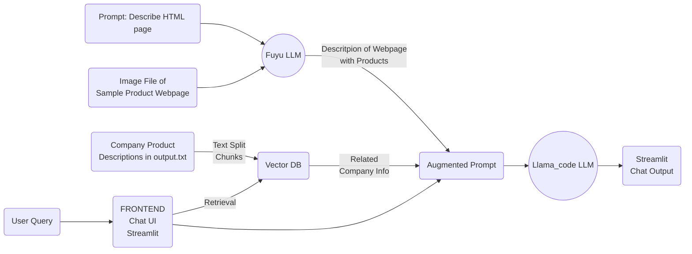

# Multimodal RAG Assistant with NVIDIA NeMo
Adapted example built on top of and using NVIDIA AI Foundation Models.

### Example Use Case
Getting sample HTML of a desired product page tailored to the user's company and its respected products.

### Brief Overview
Developed to input an image of a product section of a website. The user will then
enter their desired company from their external document. Using this information the AI Assistant
will output HTML similar to the HTML displayed in the image inputted earlier; this HTML will be
tailored to the user's selected company.

# Implemented Features
- [RAG in 5 minutes Chatbot Video](https://youtu.be/N_OOfkEWcOk) Setup with NVIDIA AI Playground components
- Source references with options to download the source document
- Analytics through Streamlit at ```/?analytics=on```
- Multimodal parsing of documents - images, text through multimodal LLM APIs
- Uses fuyu_8b to get image description
- Uses llama2_code_34b to develop code based on image description
- External document containing sample company product information in the output.txt file

## Setup Steps

The following describes how you can have this chatbot up-and-running in less than 5 minutes.

### Steps
1. Create a python virtual environment and activate it
   ```
   python3 -m virtualenv genai
   source genai/bin/activate
   ```

2. Goto the root of this repository `GenerativeAIExamples` and execute below command to install the requirements
   ```
   pip install -r experimental/multimodal_assistant/requirements.txt
   ```

3. Set your NVIDIA_API_KEY. Follow the steps 1-4 mentioned [here](../../docs/rag/aiplayground.md#prepare-the-environment) to get this.
   ```
   export NVIDIA_API_KEY="provide_your_key"
   ```

4. Go to the folder with this code and then run the example using streamlit
```
cd GenerativeAIExamples/experimental/multimodal_assistant && streamlit run Picture_to_Code_Assistant.py
```

5. Finally to test the deployed example, goto the URL `http://<host_ip>:8501` in a web browser. Click on `browse files` and select your knowledge source. After selecting click on `Upload!` button to complete the ingestion process.

6. You are all set now! Try out queries pertinent to the knowledge base using text from the UI.

The resulting server will launch on a specified port, like localhost:8501. If your machine has ports being forwarded on the public IP, it can be accessed by other people who can use `<IP_ADDR>:<PORT>` to access the chatbot.

To do port forwarding from a remote machine:
```
sudo ufw allow PORT
```

TO ssh with port forwarding:
```
ssh -L PORT:IP_ADDR:PORT localhost
```

## Architecture Diagram

Here is how the system is designed:



## Component Swapping

All components are designed to be swappable, meaning that it should be easy to replace with something more complex. Here are some options for the same (this repository may not support these, but we can point you to resources if it is something that would be useful for you):

### Frontend
- **Streamlit:** this is the current implementation of the chatbot, which makes it very easy to interact with via a WebUI. However, it requires direct access to the machine via the port on which it is streaming.

### Retrieval
This uses the NVIDIA NeMo Retriever model through NVIDIA AI Playground. This is a fine-tuned version of the E5-large-v2 embedding model, and it is commercially viable for use. This maps every user query into a 1024-dim embedding and uses cosine similarity to provide relevant matches. This can be swapped out for various types of retrieval models that can map to different sorts of embeddings, depending on the use case. They can also be fine-tuned further for the specific data being used.

### Vector DB
The vector database being used here is FAISS. It can easily be swapped out for numerous other options like ChromaDB, Pinecone, Milvus and others. Some of the options are listed on the [LangChain docs here](https://python.langchain.com/docs/integrations/vectorstores/).

### Prompt Augmentation
Depending on the backend and model, you may need to modify the way in which you format your prompt and chat conversations to interact with the model. The current design considers each query independently. However, if you put the input as a set of user/assistant/user interactions, you can combine multi-turn conversations. This may also require periodic summarization of past context to ensure the chat does not exceed the context length of the model.

### Backend
- Cloud Hosted: The current implementation uses the NVIDIA AI Playground APIs to abstract away the details of the infrastructure through a simple API call. You can also swap this out quickly by deploying in DGX Cloud with NVIDIA GPUs and LLMs.
- On-Prem/Locally Hosted: If you would like to run a similar model locally, it is usually necessary to have significantly powerful hardware (Llama2-70B requires over 100GB of GPU memory) and various optimization toolkits to run inference (TRT-LLM and TensorRT). Smaller models (Llama2-7B, Mistral-7B, etc) are easier to run but may have worse performance.

## Pipeline Enhancement Opportunities:

### Multimodal Parsing:
Upgrade the current PyMuPDF-based PDF parsing with a more sophisticated parser for improved extraction of images and tables. Employ a high-quality Multimodal Language Model (MLLM) to enhance image descriptions and implement structured data analysis techniques like text2sql or text2pandas for efficient table summarization.

### Evaluation Complexity:
Evaluating multimodal RAG pipelines is intricate due to the independence of each modality (text, images, tables). For complex queries requiring information synthesis across modalities, refining response quality becomes a challenging task. Aim for a comprehensive evaluation approach that captures the intricacies of multimodal interactions.

### Guardrails Implementation:
Implementing robust guardrails for multimodal systems presents unique challenges. Explore the introduction of guardrails for both input and output, tailored to each modality. Identify and address potential vulnerabilities by developing innovative red-teaming methodologies and jailbreak detection mechanisms to enhance overall security and reliability.

### Function-calling Agents:
Empower the Language Model (LLM) by providing access to external APIs. This integration allows the model to augment response quality through structured interactions with existing systems and software, such as leveraging Google Search for enhanced depth and accuracy in replies.

