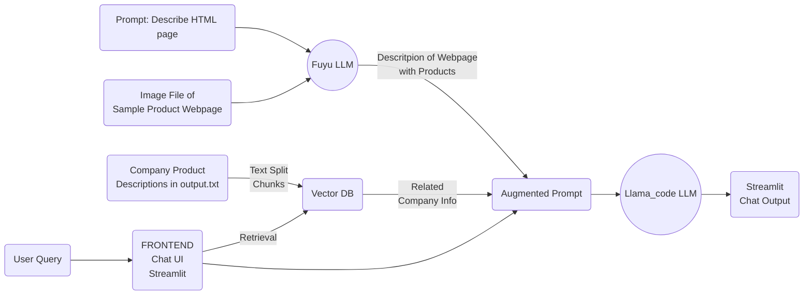

# Multimodal RAG Assistant with NVIDIA NeMo
Adapted example built on top of and using NVIDIA AI Foundation Models.

### Example Use Case
Obtaining a Sample HTML Template for a Product Page Tailored to Your Company's Specific Products.

### Brief Overview
This tool simplifies the process of refreshing product sections on websites and modifying marketing content. 
Just upload a product area image you wish to replicate and choose your company from the external documents. 
The AI Assistant will then produce HTML code that replicates the look of the image, tailored to showcase 
your specific products.

# Implemented Features
- [RAG in 5 minutes Chatbot Video](https://youtu.be/N_OOfkEWcOk) Setup with NVIDIA AI Playground components
- Source references with options to download the source document
- Analytics through Streamlit at ```/?analytics=on```
- Multimodal parsing of documents - images, text through multimodal LLM APIs
- Uses fuyu_8b to get image description
- Uses llama2_code_34b to develop code based on image description
- External document containing sample company product information in the output.txt file

## Architecture Diagram

Here is how the system is designed:


```mermaid
graph LR
E(User Query) --> A(FRONTEND<br/>Chat UI<br/>Streamlit)
J(Prompt: Describe HTML page) --> G((Fuyu LLM))
F(Image File of <br/>Sample Product Webpage) --> G
G -- Descritpion of Webpage<br/>with Products --> K(Augmented Prompt)
H(Company Product<br/>Descriptions in output.txt) -- Text Split<br/>Chunks --> N(Vector DB)
N -- Related<br/>Company Info --> K
A --> K
A -- Retrieval --> N
K --> L((Llama_code LLM))
L --> M(Streamlit<br/>Chat Output)
```
